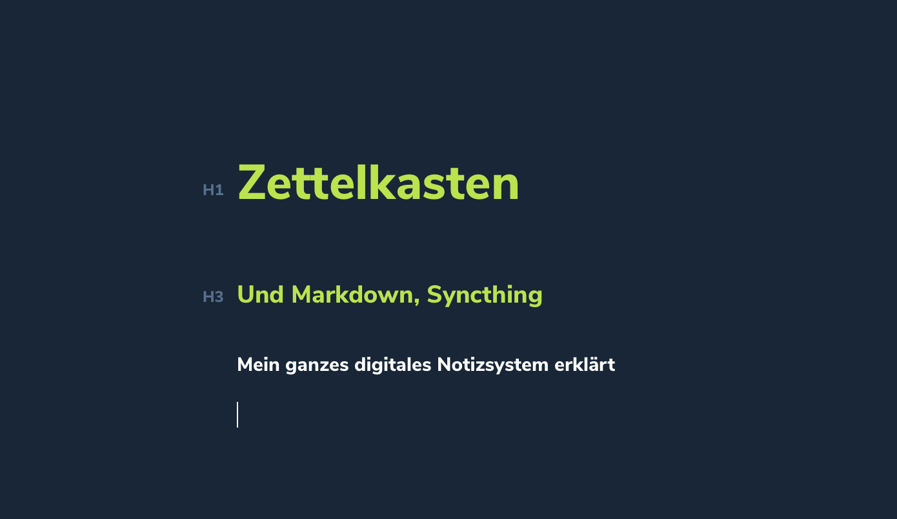

In diesem Beitrag möchte ich über meine Liebe zu Markdown sowie der Zettelkastenmethode sprechen. Außerdem zeige ich einen Interessanten Weg, wie ich diese Methode digital nutze. Opensource und recht simpel, ohne dass man "ein übelster Nerd sein muss", aber der Reihe nach. 


## Meine Liebe zu Markdown

Markdown ist einfach pure Liebe. Ich habe das lange nicht zu schätzen gewusst, aber nach dem ich vor langer Zeit mich an Markdown rangewagt habe musste ich feststellen, dass ich mir kein anderes System mehr vorstellen kann. 
Markdown ist so simpel und doch so viel - aber das wichtigste, was Markdown ist: Es ist keine "Programmiersprache" oder ähnliches. Es ist eine Syntax-Sprache, welche mit einfachsten Mitteln ermöglicht, Text zu formatieren und auszuzeichnen. 
Das Problem an Formatiertem Text, wie wir ihn beispielsweise aus Word kennen ist, dass dieser Text auf unterschiedlichen Geräten unterschiedlich aussieht. Er ist nicht leicht anpassbar, manchmal gehen Dinge verloren. Zudem ist das Format eben Abhängig von der Datei - ohne Word oder OpenOffice kann man den Inhalt oft nicht auslesen. Hier kommt Markdown ins Spiel, denn Markdown ist nur minmal veränderter "Plaintext", also reiner Text. Das sieht beispielsweise so aus: 

```markdown
# Überschrift eines Textes
## Unterüberschrift eines Textes

Text eines Textes
**Fett** *kursiv* [Linkname](Linkadresse)
```

Dies kann man so in eine .txt-Datei (oder besser noch eine .md) speichern und sich mithilfe eines Markdownparser hübsch anzeigen lassen. Dieser kann auch die Syntaxe ausblenden. Dabei kann jeder Mensch seine eigene Schriftart, Schriftgröße und Farbe wählen, ganz egal; denn an der ursprünglichen Formatierung geht ja nun nichts verloren. Dank Markdown weiß dein Ausgabeprogramm immer genau, wie der Text fließen / aussehen müsste, also was eine Überschrift ist, was eine Unterüberschrift ist und so weiter. 

Das kommt einem aber besonders im eingangs erwähnten Fall Zugute; angenommen dein Textprogramm gibt es nicht mehr. Oder du kannst, weshalb auch immer, nur noch auf die Datei zugreifen ohne das Ausgabeprogramm. Dann öffnest du einfach die .md-Datei mit dem nächstbestens Texteditor (wie beispielsweise "Editor" oder "TextEdit" etc.).

Dort wird dir zwar nun auch dieser ganze Text inklusive der Syntaxe angezeigt, aber nun kommt Markdown zu seinem Königsargument: Es ist von Menschen schnell lesbar, während andere Syntaxformen wie HTML kompliziert erscheinen und den Lesefluss wohlmöglich stören. Hier ein direkter Vergleich eines gleichen Textes in Markdown und HTML:

```markdown
# Wieso Katzen komische und süße Tiere sind
Das sollte eigentlich jeder wissen, denn Katzen sind süß.  
Da sind wir uns *alle* einig.

Aber Katzen sind auch **lustig** und manchmal ganz schön [Verrückt](https://linkzucatcontent).
```

Das war Markdown, konnte man eigentlich direkt so lesen, oder? Nun zu HTML: 

```html
<h1> Wieso Katzen komische und süße Tiere sind</h1><br>
<p>Das sollte eigentlich jeder wissen, denn Katzen sind süß.<br>
Da sind wir uns <i>alle</i> einig.<br></p>

<p>Aber Katzen sind auch <b>lustig</b> und manchmal ganz schön <a href="https://linkzucatcontent">Verrückt</a>.</p>
```

Ich denke, in langen und teilweise stark formatierten Texten ist Markdown ziemlich sicher der Gewinner in Punkto Einfachheit. 

Eine ganze Anleitung wie Markdown funktioniert und welche Möglichkeiten man alles hat, findest du übrigens [hier](https://www.markdownguide.org/cheat-sheet).

## Nun zur Zettelkastenmethode

Die Zettelkastenmethode ist eine *besondere* Art und Weise, Notizen zu erfassen und besonders, wie man diese **katalogisiert**. Aber wieso nicht einfach Evernote / klassiches Notizbuch oder ähnliches nutzen? 

*Nebeninfo: Ich nutze auch ein klassisches Notizbuch, dazu jedoch später mehr.*

Ich zitiere an dieser Stelle einfach mal die deutsche Wikipedia: 

> Der Zettelkasten oder Katalogkasten (veraltet teilweise auch Kartothek) ist ein Hilfsmittel bei der Erstellung einer literarischen oder wissenschaftlichen Arbeit. Wichtig erscheinende Sachverhalte, die man z. B. in einem Buch gefunden hat, werden mit Quellenangabe auf Zetteln oder Karteikarten notiert und in Kästen aufbewahrt und geordnet. 

Besonders gute Informationen zur Methodik und auch deutlich mehr findest du übrigens auch hier: https://zettelkasten.de/

Ich nutze diese Methode sehr simpel; auf meiner Festplatte gibt es einen Ordner, er nennt sich passenderweise "Dateienkasten", da ich "Zettel" auf einem Rechner doch eher befremdlich finde und mal was wagen wollte! Dieses Ordner wird im übrigen auch synchronisiert, dazu später mehr. 

In diesem Ordner befinden sich alle meine "Zettel", in Form von einzelnen .md-Dateien, also Markdowndateien. Sie folgen alle einem Schema, bis auf eine. Diese eine ist ``` 01.md ``` welche eine lose Sammlung von Stichpunkten oder auch Links enthält, welche sehr vergänglich sind und nicht von wirklicher Relevanz für mich. Ich lösche da alles regelmäßig raus, außer ich finde etwas doch relevantes, dann erhält es aber eine eigene Datei. Die anderen Dateien sind nach einem Schema benannt; JahrMonatTagStundeMinuteSekunde - also chronologisch. Die Datei, in welcher ich diesen Artikel im übrigen "vorschreibe" und konzeptioniere lautet ```20210123230631.md``` da sie zu diesem Zeitpunkt entstanden ist. 

In einer solchen Datei sieht der Inhalt dann oft ähnlich aus. Hier mal grob vereinfacht: 

```markdown
# 20201203204109 Weihnachtsgeschenk für den Hund
#Weihnachten #Geschenk #Hund #Idee
Könnte nen Knochen werden, oder auch ein Hundekeks. Vielleicht auch einfach nur Spielzeug, was quietscht.
```

Zunächst fange ich im Titel mit dem Dateinamen an, worauf der eigentliche Titel folgt. Darunter kommen in der nächsten Zeile die Tags. Diese werden nur mit #Wasauchimmer gesetzt und vereinfachen später das Suchen und Zuorden. Und dann folgt der ganze restliche Kram. 

Ich nutze zum Editieren und Durchsuchen / Lesen meiner Zettel die Software [Typora](https://typora.io), welche ich ausdrücklich empfehlen kann. Mit Sicherheit wird Typora eines Tages Geld kosten, aber dann werde ich sie kaufen. Noch befindet sich diese sehr reife und in meinen Augen schon perfekte Software in der Entwicklung und ist daher noch kostenlos - Hut ab und Gruß an die Entwickler an dieser Stelle. Typora ist auf Mac, Linux und Windows nutzbar. 

### Synchronisierung

Die Synchronisierung ist eigentlich recht simpel, da es ja nur einen Ordner mit vielen, vielen Dateien gibt welchen ihr zwischen euren Rechnern und Handys synchronisieren müsst. Dafür könnte man einfach einen USB-Stick, den nächstbesten Cloudanbieter oder auch eigene Serverdienste wie Nextcloud nutzen. Ich verwende jedoch [Syncthing](https://syncthing.net/) - fragt mich nicht weshalb. Vielleicht, weil man *keinen Zentralen Server braucht*, obwohl ich sogar einen eigenen Syncthingserver (zwecks tiefgehender Versionierung etc.) betreibe und das ganze End-to-End Verschlüsselt ist. Aber letztlich könntet ihr auch Dropbox, Icloud, oder was auch immer nehmen. Wie gesagt, theoretisch reicht auch ein USB-Stick. Typora ist übrigens unter Windows, Mac und Linux nutzbar - das macht es halt echt super angenehm und einfach. 
